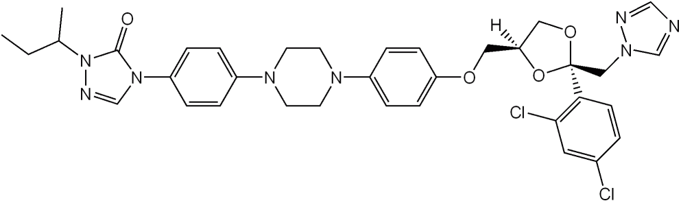

# Itraconazole-Model
Whole-body PBPK model of itraconazole. 

  

 
This itraconazole model is intended to be used as a perpetrator in CYP3A4-mediated drug-drug interactions. The model includes the sequential metabolites hydroxy-itraconazole, keto-itraconazole and N-desalkyl-itraconazole. All of them are substrates and competitive inhibitors of CYP3A4.

Additional features of the model represent P-gp inhibition.

The model is also suitable for pediatric translations with regard to CYP3A4 ontogeny.

## Repository files

Within this repository, we distribute a whole-body PBPK model of itraconazole, that has been developed using a large number of clinical studies and evaluated within the DDI modeling network.

The PK-Sim project file contains simulations of all published clinical studies employed during model establishment, including the respective observed data digitized from literature reports. For further details, quantitative model evaluation, sensitivity analysis and extensive documentation please refer to Hanke et al. 2018 [[1](#reference)].

In comparison to the published version by Hanke et al. 2018 [[1](#reference)], the dissolution and solubility has been optimized and updated for the administration of itraconazole capsules in fasted state.

## Code of conduct
Everyone interacting in the Open Systems Pharmacology community (codebases, issue trackers, chat rooms, mailing lists etc...) is expected to follow the Open Systems Pharmacology [code of conduct](https://github.com/Open-Systems-Pharmacology/Suite/blob/master/CODE_OF_CONDUCT.md#contributor-covenant-code-of-conduct).

## Contribution
We encourage contribution to the Open Systems Pharmacology community. Before getting started please read the [contribution guidelines](https://github.com/Open-Systems-Pharmacology/Suite/blob/master/CONTRIBUTING.md#ways-to-contribute). If you are contributing code, please be familiar with the [coding standard](https://github.com/Open-Systems-Pharmacology/Suite/blob/master/CODING_STANDARDS.md#visual-studio-settings).

## License
The model code is distributed under the [GPLv2 License](https://github.com/Open-Systems-Pharmacology/Suite/blob/develop/LICENSE).

## Reference
[1] [Hanke N, Frechen S, Moj D, Britz H, Eissing T, Wendl T, Lehr T. PBPK models for CYP3A4 and P-gp DDI prediction: a modeling network of rifampicin, itraconazole, clarithromycin, midazolam, alfentanil and digoxin. CPT: Pharmacometrics & Systems Pharmacology (2018)](https://ascpt.onlinelibrary.wiley.com/doi/abs/10.1002/psp4.12343)

